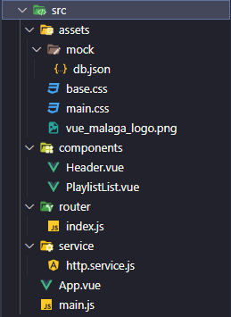

# VUETIFY - Tu primera app con Vue
###### VueMálaga, Jesús Narbona y Raúl Aguilar

---

## Índice
- [Introducción a Vue]()
- [Explicación del proyecto]()
  - [Distintas ramas]()
  - [Estructura del proyecto]()
  - [Como arrancar la aplicación]()
- [Objetivos / ToDo]()
- [Aplicación final]()
  
---
## Introducción a Vue

---

## Explicación sobre el proyecto

En este proyecto vamos a desarrollar una aplicación paso a paso con Vue, en el que empezaremos con un proyecto casi vacio y poco a poco iremos avanzando.
Cada avance será explicado en los distintos **README.md** de cada rama.

- [Rama 1 - Artist and ArtistList](https://github.com/Vue-Malaga/your-first-app/tree/artist-and-artistlist/src/components), en esta rama crearemos nuestros primeros componentes y haremos uso de directivas propias de **Vue**.
- [Rama 2 - Filter artists](https://github.com/Vue-Malaga/your-first-app/tree/filter-artists), en la segunda rama aprenderemos a filtrar los diferentes artistas que hemos creado en la rama anterior, haremos uso de otras directivas bastantes importantes de **Vue**.
- [Rama 3 - Artists tracks](https://github.com/Vue-Malaga/your-first-app/tree/artist-tracks), al dar click a los diferentes artistas podremos acceder a sus canciones, en esta rama aprenderemos el uso de eventos en **Vue** además de lo aprendido anteriormente.
- [Rama 4 - Proyecto final](https://github.com/Vue-Malaga/your-first-app/tree/final), esta rama es un extra, en ella explicamos en profundidad diferentes conceptos que han sido utilizados a lo largo del proyecto, como puede ser **Routes**, **Pinia** y **Request de datos (fetch)**

Esta rama **"base"** es el inicio del proyecto en el cual tenemos que fijarnos y trabajar en el siguiente directorio:


- 📁**assets**:
  - Esta carpeta contiene entre otras cosas los **estilos CSS**, **imagenes** y una carpeta de datos falsa **mock** en la que tendremos nuestra base de datos inventada
- 📁**components**:
  - Esta carpeta será la encargada de almacenar los distintos componentes que vayamos creando, en este caso tendemos creados dos **Header** el cual es la cabecera de la página y **PlaylistList** el cual es el componente el cual lista todas las playlist que hemos creado.
- 📁**router**:
  - La carpeta router es la contenedora de nuesto archivo de rutas **index.js** que explicaremos en la rama final
- 📁**service**:
  - Esta carpeta contiene todos los servicios que tenemos en nuestro proyecto, en este caso solo tenemos un servicio **http.service.js** que mediante su uso vamos a poder hacer peticiones http a nuestra base de datos falsa
- 📄**App.vue**:
  - Va a ser nuestro componente principal en cual va a contenter todos los demás componentes, en otras palabras va a ser el **"Componente padre"**
- 📄**main.js**:
  - Este archivo va a ser el encargado de montar la aplicación final mediante funciones predefinidas de **Vue** como es **createApp**, en otras palabras la funcion de Vue se va a encargar de montar la aplicacion en un nodo HTML de nuestro archivo **index.html** en este caso en un nodo que es un contenedor con un id **"app"**.
    ```html
    <body>
        <div id="app" class="app"></div>
        <script type="module" src="/src/main.js"></script>
    </body>
    ```

#### ¿Como arrancar el proyecto?
Si nos fijamos en el **package.json** encontramos como iniciar el proyecto, pero antes de nada deberíamos instalar las dependencias.

```bash
#Entrar en la carpeta clonada
cd your-first-app
#Para instalar las depencias/node_modules
npm i
```

Una vez instaladas podemos ver el **package.json**
```json
{
  ...
  "scripts": {
    "dev": "vite",
    "build": "vite build",
    "preview": "vite preview",
    "api": "json-server --watch src/assets/mock/db.json"
  },
  ...
}
```
Tenemos cuatro scripts para poder usar en nuestra aplicación:
```bash
#Para ejecutar un servidor de desarrollo
npm run dev
#Para ejecutar un servidor backend falso
npm run api
#Para generar los archivos de fase de producción
npm run build
#Para ejecutar un servidor con los archivos de producción
npm run preview
```

**IMPORTANTE**
> En nuestro proyecto los que vamos a utilizar son **npm run dev** y **npm run api**, **deberemos de ejecutarlos a la vez** ya que necesitamos cargar informacion y hacer peticiones http.

---
## Objectivos / ToDo
El objetivo principal de este proyecto es aprender desde cero **Vue 3** utilizando **Composition API**.

La lista de objetivos o tareas a completar para las distintas ramas:
- [ ] Crear un **componente artista** y otro que pueda cargar una **lista de artistas** utilizando el componente anterior.
    
- [ ] Al dar **click** a un artista, tienen que cargar todas sus canciones.
    
- [ ] **Filtrar la lista de artistas** con un campo de buscar, este campo tiene que tener una **busqueda dinámica**, es decir cada vez que se escribe en él se va filtrando los artistas.
    

