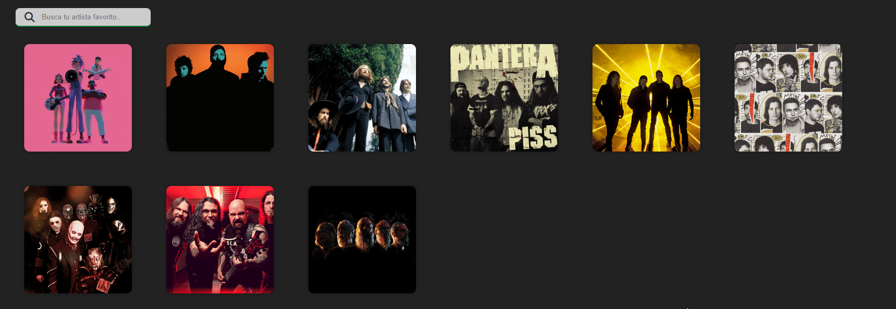

# VUETIFY - Tu primera app con Vue
VueMálaga, Jesús Narbona y Raúl Aguilar

---

## Índice
- [VUETIFY - Tu primera app con Vue](#vuetify---tu-primera-app-con-vue)
  - [Índice](#índice)
  - [Introducción a Vue](#introducción-a-vue)
      - [¿Qué es Vue?](#qu%C3%A9-es-vue)
      - [Single File Components (SFC)](#single-file-components-sfc)
      - [Options API vs Composition API](#options-api-vs-composition-api)
      - [Recomendaciones para trabajar con Vue](#recomendaciones-para-trabajar-con-vue)
  - [Explicación sobre el proyecto](#explicación-sobre-el-proyecto)
      - [Las ramas](#las-ramas)
      - [Estructura](#estructura)
      - [¿Como arrancar el proyecto?](#como-arrancar-el-proyecto)
  - [Objetivos / ToDo](#objectivos--todo)
  - [Aplicación final](#aplicación-final)
    - [Posibles features](#posibles-features)
  
---
## Introducción a Vue

### ¿Qué es Vue?
[Vue](https://vuejs.org/) es un framework de JavaScript para construir aplicaciones del lado del cliente. Se caracteriza por ser lo que los creadores llaman un **framework progresivo**. Esto significa que todas las características del framework están divididas en varios paquetes y es el usuario el que decide si usarlos o no en su aplicación. Gracias a esto consigue que el tamaño final de las aplicaciones sea muy pequeño.

### Single File Components (SFC)
En Vue, todos los componentes son creados en un mismo fichero. La sintaxis para crear cada componente es la siguiente:
```vue
<template>
  <!-- Código HTML o Pug -->
</template>

<script>
  // Código JS o TS
</script>

<style>
  /* Código CSS o SASS */
</style>
```

### Options API vs Composition API
Si nos centramos en la etiqueta **<script>** de los _SFC_, Vue cuenta con dos posibles formas de escribir código JavaScript dentro de ella:

- Options API: Toda la lógica del componente se define mediante un objeto de opciones con diversas propiedades, tal y como se ve en el siguiente ejemplo:
```vue
<script>
export default {
  data() {
    return {
      contador: 0
    }
  },

  methods: {
    incrementar() {
      this.contador++
    }
  },
  
  mounted() {
    console.log(`El valor inicial del contador es ${contador.value}.`)
  }
}
</script>
```

- Composition API: La lógica se define usando funciones de la API de Vue. Para ello, seguimos haciendo uso de un objeto pero dentro de él se encontrará la función **setup()**, en la cual definiremos todo lo necesario, tal y cómo se ve en el siguiente ejemplo:
```vue
<script>
  import { ref, onMounted } from 'vue'

  export default ({
    setup() {
      const contador = ref(0)

      function incrementar() {
        contador.value++
      }

      onMounted(() => {
        console.log(`El valor inicial del contador es ${contador.value}.`)
      })

      return {
        contador,
        incrementar
      }
    }
  })
</script>
```

Sin embargo, con Composition API no es común trabajar de esta manera ya que resulta innecesario tener que exportar un objeto con solo una función (puede tener más cosas, pero eso más adelante...). Por ello se creó un nuevo atributo para la etiqueta <script>, el **atributo setup**. Al colocar dicho atributo podemos transformar el código anterior a algo como esto:
```vue
<script setup>
import { ref, onMounted } from 'vue'

const contador = ref(0)

function incrementar() {
  contador.value++
}

onMounted(() => {
  console.log(`El valor inicial del contador es ${contador.value}.`)
})
</script>
```

> En este proyecto vamos a usar **Composition API con <script setup>**.

### Recomendaciones para trabajar con Vue
Aquí van una serie de tips que te ayudarán a la hora de crear tu primera aplicación en Vue:
- Instalar la extensión [Volar](https://marketplace.visualstudio.com/items?itemName=Vue.volar) en Visual Studio Code (o tu editor de confianza), ya que proporciona intellisense y marcado de sintaxis.
- Instalar las [Vue Devtools](https://devtools.vuejs.org/) en tu navegador, ya que te ayudarán a ver el árbol de componentes, además de ver y seguir cada una sus características
- Trata de usar nombres para los componentes que no lleven a confusión con etiquetas HTML
- Para llamar a los componentes usa _PascalCase_, y para las props o atributos de estos usa _kebab-case_, aunque esto va a gustos. Lo importante es mantener dicha nomenclatura a lo largo de todo el proyecto
- Sigue la misma estructura en todos los _SFC_, así te será más fácil localizar las cosas en ellos

---

## Explicación sobre el proyecto

En este proyecto vamos a desarrollar una aplicación paso a paso con Vue, en el que empezaremos con un proyecto casi vacío y poco a poco iremos avanzando.
Cada avance será explicado en los distintos **README.md** de cada rama.

#### Las ramas
- [Rama 1 - Artist and ArtistList](https://github.com/Vue-Malaga/your-first-app/tree/artist-and-artistlist/src/components), en esta rama crearemos nuestros primeros componentes y haremos uso de directivas propias de **Vue**.
- [Rama 2 - Filter artists](https://github.com/Vue-Malaga/your-first-app/tree/filter-artists), en la segunda rama aprenderemos a filtrar los diferentes artistas que hemos creado en la rama anterior, haremos uso de otras directivas bastantes importantes de **Vue**.
- [Rama 3 - Artists tracks](https://github.com/Vue-Malaga/your-first-app/tree/artist-tracks), al dar click a los diferentes artistas podremos acceder a sus canciones, en esta rama aprenderemos el uso de eventos en **Vue** además de lo aprendido anteriormente.
- [Rama 4 - Proyecto final](https://github.com/Vue-Malaga/your-first-app/tree/final), esta rama es un extra, en ella explicamos en profundidad diferentes conceptos que han sido utilizados a lo largo del proyecto, como puede ser **Routes**, **Pinia** y **Request de datos (fetch)**

#### Estructura
Esta rama **"base"** es el inicio del proyecto en el cual tenemos que fijarnos y trabajar en el siguiente directorio:


- 📁**assets**:
  - Esta carpeta contiene entre otras cosas los **estilos CSS**, **imágenes** y una carpeta de datos falsa **mock** en la que tendremos nuestra base de datos inventada
- 📁**components**:
  - Esta carpeta será la encargada de almacenar los distintos componentes que vayamos creando, en este caso tendemos creados dos **Header** el cual es la cabecera de la página y **PlaylistList** el cual es el componente el cual lista todas las playlist que hemos creado.
- 📁**router**:
  - La carpeta router es la contenedora de nuestro archivo de rutas **index.js** que explicaremos en la rama final
- 📁**service**:
  - Esta carpeta contiene todos los servicios que tenemos en nuestro proyecto, en este caso solo tenemos un servicio **http.service.js** que mediante su uso vamos a poder hacer peticiones http a nuestra base de datos falsa
- 📄**App.vue**:
  - Va a ser nuestro componente principal en cual va a contener todos los demás componentes, en otras palabras va a ser el **"Componente raíz"**
- 📄**main.js**:
  - Este archivo va a ser el encargado de montar la aplicación final mediante funciones predefinidas de **Vue** como es **createApp**, en otras palabras la función de Vue se va a encargar de montar la aplicación en un nodo HTML de nuestro archivo **index.html** en este caso en un nodo que es un contenedor con un id **"app"**.
    ```html
    <body>
        <div id="app" class="app"></div>
        <script type="module" src="/src/main.js"></script>
    </body>
    ```

#### ¿Como arrancar el proyecto?
Si nos fijamos en el **package.json** encontramos como iniciar el proyecto, pero antes de nada deberíamos instalar las dependencias.

```bash
#Entrar en la carpeta clonada
cd your-first-app
#Para instalar las dependencias/node_modules
npm i
```

Una vez instaladas podemos ver el **package.json**
```json
{
  ...
  "scripts": {
    "dev": "vite",
    "build": "vite build",
    "preview": "vite preview",
    "api": "json-server --watch src/assets/mock/db.json"
  },
  ...
}
```
Tenemos cuatro scripts para poder usar en nuestra aplicación:
```bash
#Para ejecutar un servidor de desarrollo
npm run dev
#Para ejecutar un servidor backend falso
npm run api
#Para generar los archivos de fase de producción
npm run build
#Para ejecutar un servidor con los archivos de producción
npm run preview
```

**IMPORTANTE**
> En nuestro proyecto los que vamos a utilizar son **npm run dev** y **npm run api**, **deberemos de ejecutarlos a la vez** ya que necesitamos cargar información y hacer peticiones http.

---
## Objetivos / ToDo
El objetivo principal de este proyecto es aprender desde cero **Vue 3** utilizando **Composition API**.

La lista de objetivos o tareas a completar para las distintas ramas:
- [ ] Crear un **componente artista** y otro que pueda cargar una **lista de artistas** utilizando el componente anterior.
    
- [ ] Al dar **click** a un artista, tienen que cargar todas sus canciones.
    
- [ ] **Filtrar la lista de artistas** con un campo de buscar, este campo tiene que tener una **busqueda dinámica**, es decir cada vez que se escribe en él se va filtrando los artistas.
    

---
## Aplicación final
Una vez terminada todas las ramas tendríamos esta aplicación:


### Posibles features
- [ ] Simplificar los popUps con librerías
- [ ] Simplificar los alerts con librerías (SweetAlert)
- [ ] Implementar cuentas
- [ ] Implementar register y login
- [ ] Implementar compartir listas con usuarios

Os animamos a **modificar** y a **avanzar** la aplicación a vuestro gusto.
> Si es el caso, nos gustaría que lo compartierais en las redes para poder ver vuestros avances etiquetando si es posible a **@VuejsMalaga**.
> 
> Cualquier duda o comentario podemos resolverlo através de Twitter **@VuejsMalaga**.

