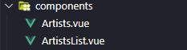
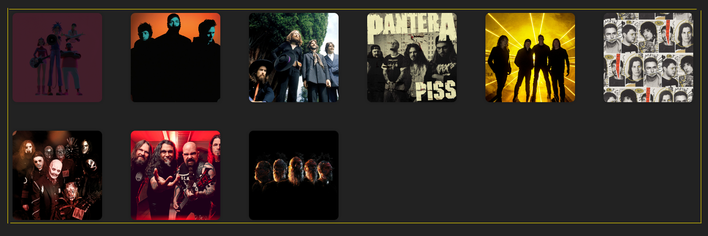
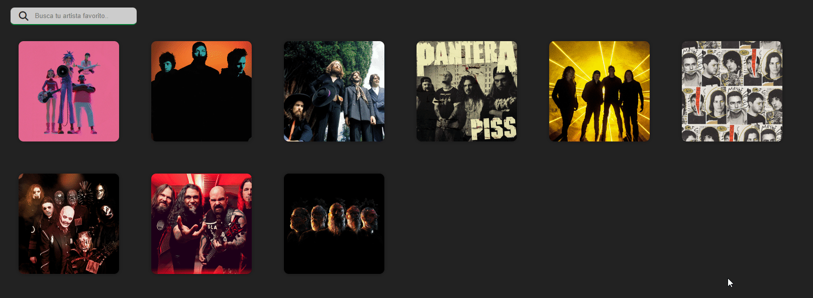

# VUETIFY - Tu primera app con Vue
VueMálaga, Jesús Narbona y Raúl Aguilar

---
## Índice

- [VUETIFY - Tu primera app con Vue](#vuetify---tu-primera-app-con-vue)
  - [Índice](#índice)
  - [Rama 1 - Artits and ArtistList (componentes)](#rama-1---artits-and-artistlist-componentes)
    - [Crear componente Artist](#crear-componente-artist)
      - [Definiendo el script de nuestro componente](#definiendo-el-script-de-nuestro-componente)
      - [Definiendo el html de nuestro componente](#definiendo-el-html-de-nuestro-componente)
    - [Crear componente ArtistList](#crear-componente-artistlist)
      - [Definiendo el script de nuestro componente](#definiendo-el-script-de-nuestro-componente-1)
      - [Definiendo el html de nuestro componente](#definiendo-el-html-de-nuestro-componente-1)
    - [Resultado final](#resultado-final)

---
## Rama 1 - Artits and ArtistList (componentes)

En esta rama vamos a aprender a como crear un componente, como pasar **props** o propiedades y utilizar directivas propias de Vue.

Primeramente deberemos crear el componente Artist (en el caso que no este creado), por convencion y estructuracion del proyecto lo crearemos en la carpeta **components**:


---
### Crear componente Artist

Primeramente como dije deberemos de crear Artist por lo cual deberiamos entrar dentro del archivo **Artist.vue**, que contendría el siguiente contenido:
```vue
<template>
</template>

<script setup>
</script>

<style scoped>
figure {
    border-radius: 10px;
    margin: 2rem;
    box-shadow: 0 0 10px rgba(0, 0, 0, 0.2);
    position: relative;
}

.image {
    width: 200px;
    height: 200px;
    overflow: hidden;
    display: flex;
    justify-content: center;
    align-items: center;
    border-radius: 10px;
}
...
</style>
```

Donde como dijimos en la rama base el archivo de un componente Vue se divide en tres partes:

- **Template** ``<template> ... </template>``: Es la parte donde vamos a crear el **HTML** de nuestro componente.
- **Script** ``< setup> ... </script>``: Es la parte donde crearemos nuestro código de JS o TS
  >Si nos fijamos la etiqueta **script** contiene un atributo **setup**, este atributo indica que en este proyecto estamos trabajando con **Composition API**.
- **Styles** ``<style scoped> ... </style>``: Es la parte en la que estableceremos el **estilo** de nuestro componente, mediante **código css** o otros como sass.
  >También si nos fijamos tiene un atributo **scoped**, este atributo es bastante importante ya que al ponerlo los estilos que creemos solo se van a aplicar a este componente y no al resto.

#### Definiendo el script de nuestro componente
Si pensamos bien queremos tener un componente que **reciba un dato** del exterior o de un componente padre, digamos que nostros en un futuro vamos a crear componentes tipo Artist que le pasemos un objeto artista con toda la informacion.

Aqui entran los **props**, en este caso en nuesto código se aplicaría de la siguienet forma:
```vue
...
<script setup>
const props = defineProps({
    artist: {
        type: Object,
        required: true,
    },
});
</script>
...
```
**¿Que hemos hecho?**
Hemos creado una variable llamada **props** y con un método **defineProps()** al que le pasamos un objeto con la cantidad de props que vamos a querer, este método nos lo da Vue.
Otro ejemplo de crear props:
Imaginemos que queremos almacenar el nombre de una persona y su edad:
```vue
...
<script setup>
const props = defineProps({
    name:{
      type: String,
      default: "Vue Málaga", //Es opcional indica el valor por defecto si no le pasamos el prop al crearlo
    },
    years:{
      type: Number,
      required: true, //Es opcional, indica que es requerido pasar los años al crear el componente
    },
});
</script>
...
```

#### Definiendo el html de nuestro componente
Vamos a diseñar el HTML necesario para poder montar nuestro componente tal y como lo queremos, es decir como aparece en la siguiente imagen:


Es decir nostros de los **props** que hemos pasado al componente vamos a necesitar la imagen (url) y las canciones para poder calcular la cantidad de canciones.

La etiqueta ``<template>`` quedaría tal que asi:

```vue
<template>
    <figure>
        <div class="image">
            
        </div>
        <figcaption>
            <h3>{{ artist.name }}</h3>
            <p>Canciones {{ artist.tracks.length }}</p>
        </figcaption>
    </figure>
</template>
...
```
>En la imagen si nos fijamos debemos de poner un "**:src**" debido a que se trata de un atributo que va cambiar dinámicamente Vue necesita saber que ese atributo proviene de una variable. De igual modo ""**:alt**"

La estructura HTML puede cambiar dependiendo del diseño de nuestro componente pero lo que es la llamada a los valores de los props es exactamente igual.
Como dije antes cuando queremos pasar valores de props por atributos Vue nos obliga a poner **:atributo = "artist.name"**, en el caso de que no sea una etiqueta podemos llamar al valor del prop con el uso de llaves **{{artist.name}}**.

---

### Crear componente ArtistList

Ahora que ya tenemos nuestro componente Artist creado vamos a crear el componente ArtistList, este componente va a ser el que nos muestre una lista de artistas, para ello vamos a crear un array de artistas y lo vamos a recorrer con un bucle **v-for** el cual es una directiva de Vue.

#### Definiendo el script de nuestro componente
```vue	
...
<script setup>
import { ref, onMounted } from "vue";
import Artists from "./Artists.vue";
import { get } from "../service/http.service";
const artists = ref([]);

onMounted(async () => {
    const response = await get("http://localhost:3000/artists");
    artists.value = response;
});
</script>
```
**¿Que hemos hecho?**
- Importamos los componentes que vamos a necesitar, en este caso el componente Artist y el servicio http.service.
- Creamos una variable llamada **artists** la cual es un **ref** que es un tipo de dato que nos da Vue para poder almacenar datos, en este caso es un array de artistas.
- Creamos un **onMounted** que es un método que nos da Vue para poder ejecutar código cuando el componente se monta, en este caso lo que hacemos es llamar al servicio http.service para que nos devuelva los artistas y los almacenamos en la variable **artists**.

#### Definiendo el html de nuestro componente
Vamos a diseñar el HTML necesario para poder montar nuestro componente tal y como lo queremos, es decir como aparece en la siguiente imagen:



Es decir nostros en el sript hemos realizado una petición al servicio http.service para que nos devuelva los artistas y los hemos almacenado en la variable **artists**.
Y queremos crear un componente Artist por cada artista que nos devuelva el servicio.

La etiqueta ``<template>`` quedaría tal que asi:
```vue
<template>
    <main>
        <section class="artists">
            <Artists :artist="artist" v-for="artist in artists" :key="artist.id" />
        </section>
    </main>
</template>
```
Como podemos observar hemos llamado a nuestro componente Artist que creamos y hemos importado en el script, y le hemos pasado el artista que estamos recorriendo en el bucle **v-for**.
> **:key** es una directiva de Vue que nos permite identificar de forma única cada elemento que estamos recorriendo en el bucle **v-for**. 
  Es una buena práctica a la hora de recorrer un array de objetos en Vue.

---

### Resultado final



